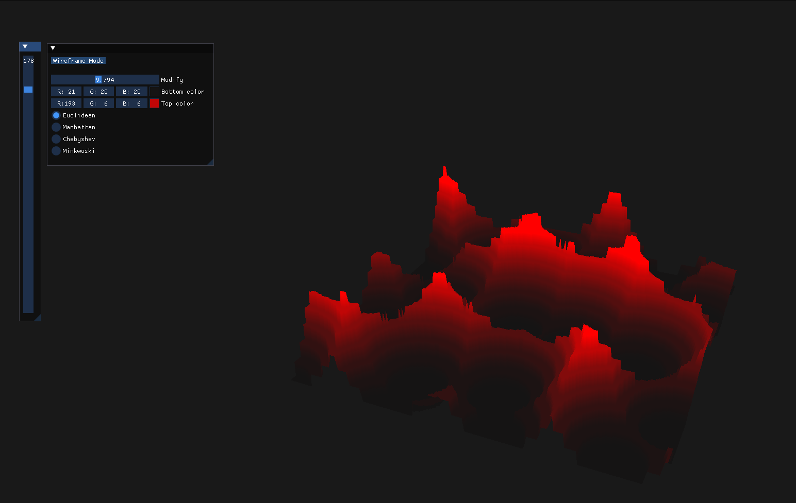
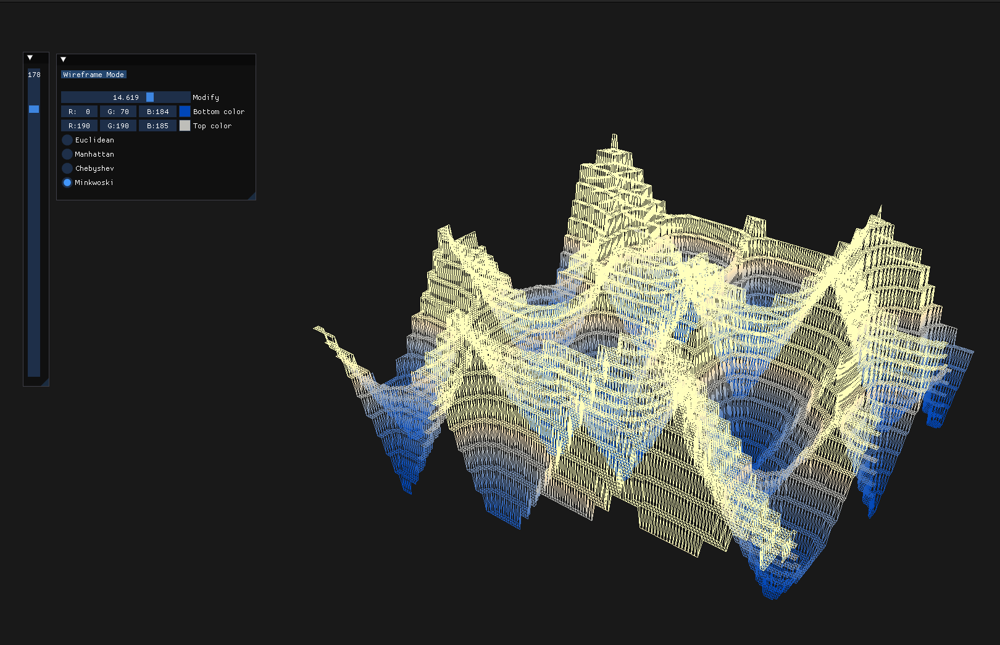
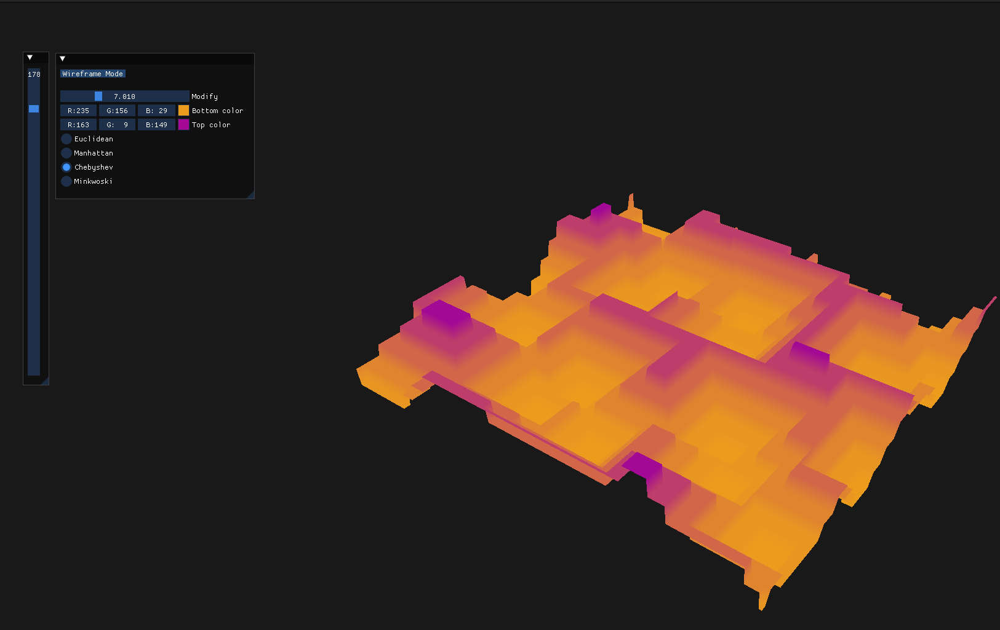

# Tesselation of procedurally generated terrains





## Building on Linux: ##

Before running the application you will need following packages:

```
build-essential mesa mesa-dev mesa-common-dev mesa-utils glfw-x11 glm
```
To compile it simply use:
```make```
in 
```/src``` folder

And finally to execute the application use:
```./prog```
